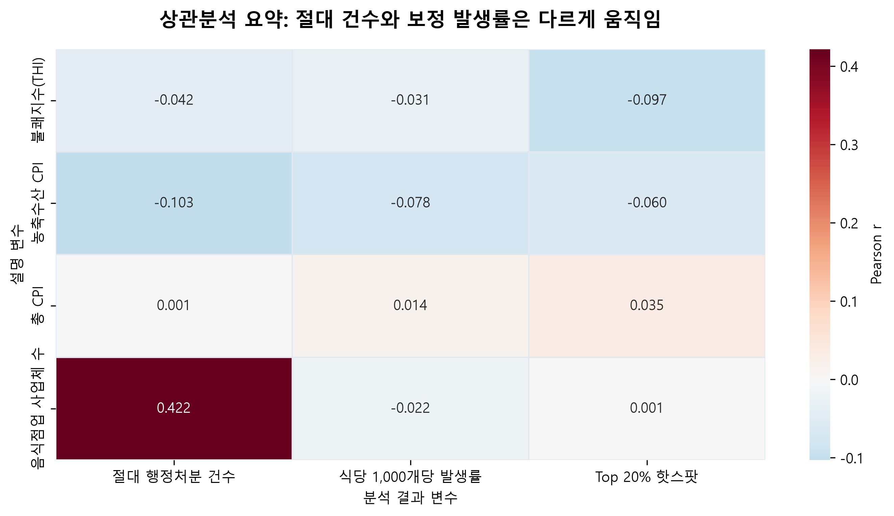
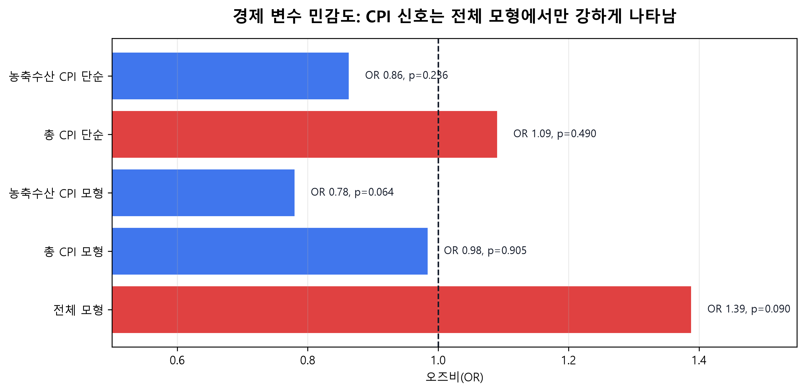
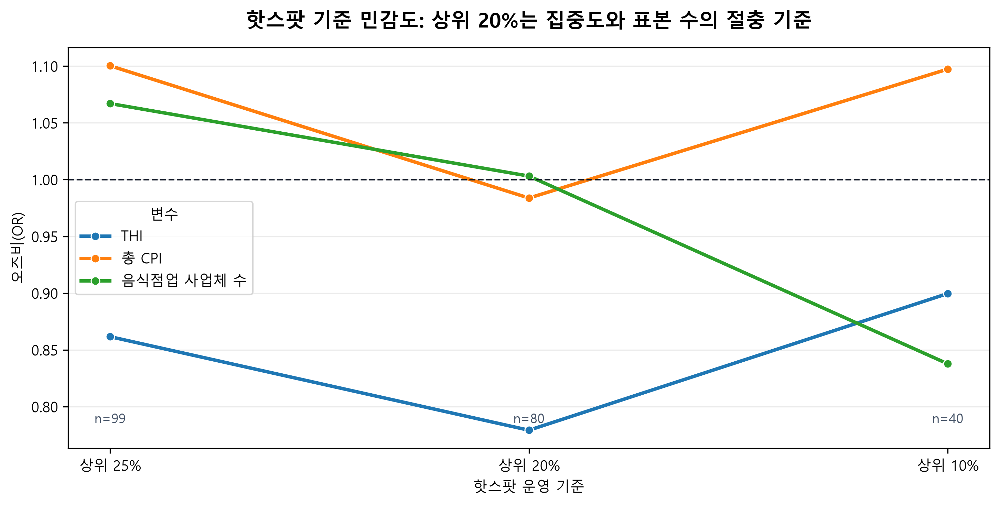
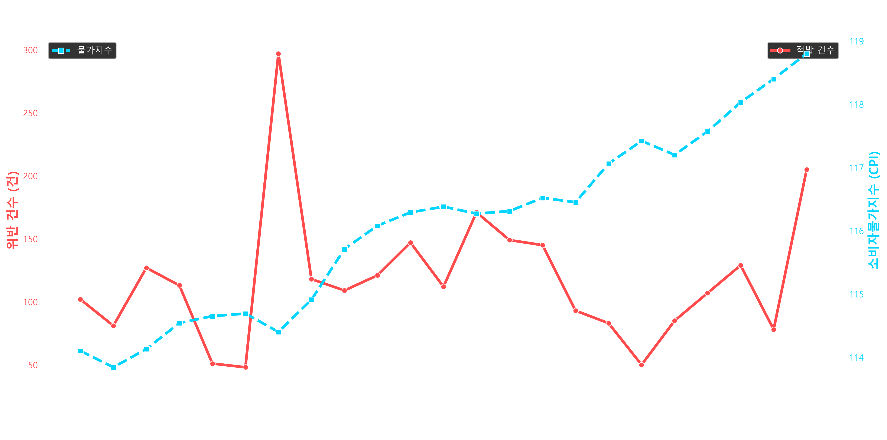
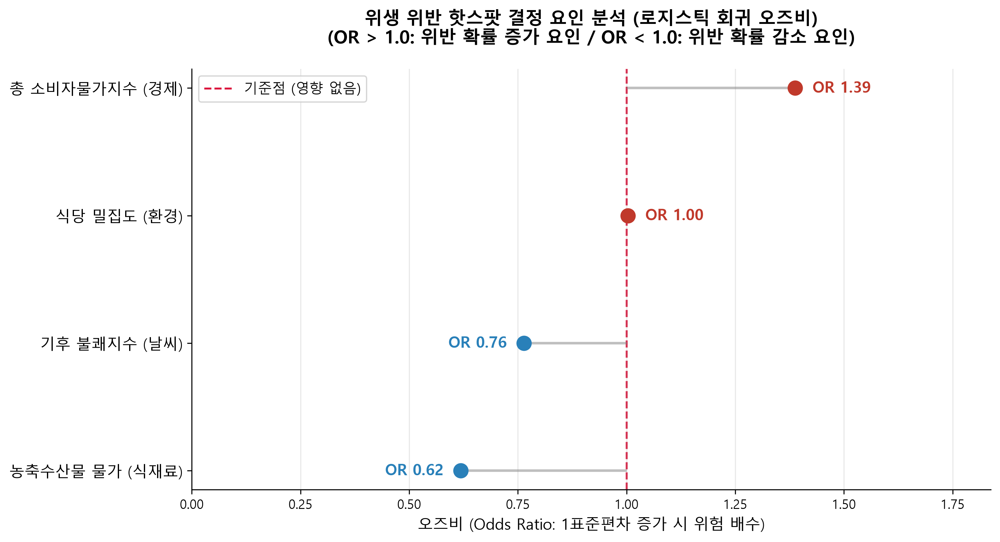
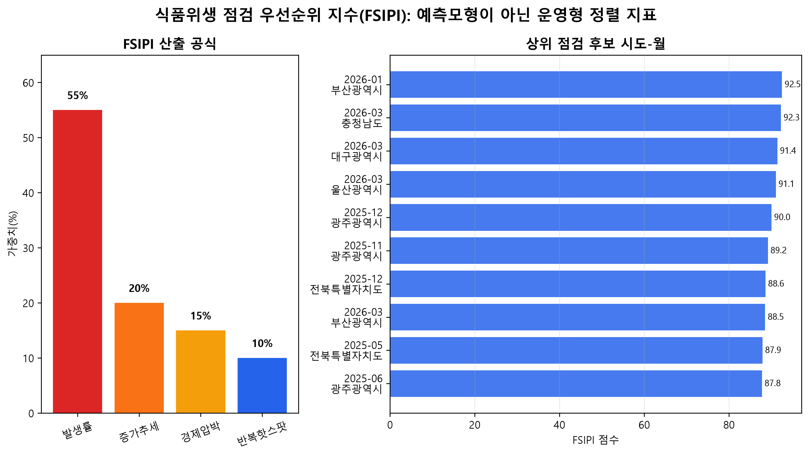

# 「2026년 국가데이터 활용대회」 데이터분석 포스터 설명서

## 제목

**물가가 오르면 동네 식당의 위생도 흔들릴까?**  
경제·기후·상권 데이터를 융합한 식품접객업 행정처분 취약 신호 탐지 및 점검 타겟팅 전략

---

## 1. 배경

### □ 주제 선정

본 연구의 핵심 질문은 다음과 같다.

> 물가 상승 등 경제적 압박이 커지는 시기에 동네 음식점의 식품위생 행정처분 위험도 함께 높아지는가?

◦ **외식업 경영 부담 증가에 따른 식품위생 취약 가능성**

최근 식재료비, 인건비, 임대료, 공공요금 상승으로 음식점의 운영비 부담이 지속적으로 증가하고 있다. 음식점은 제한된 매출 안에서 식재료 구매, 종사자 고용, 시설 유지, 위생관리 비용을 동시에 부담해야 한다. 이러한 경제적 부담에 고온·다습한 기상조건이나 상권 환경이 함께 작용할 경우, 식품 보관과 위생관리에 필요한 부담이 확대될 가능성이 있다.

◦ **사후 적발 중심 단속체계의 한계**

그러나 기존 식품위생 단속은 이미 위반이 발생한 지역이나 절대 위반 건수가 많은 지역에 집중되기 쉽다. 음식점 수가 많은 대도시와 대형 상권은 구조적으로 행정처분 건수도 많아질 수 있으므로, 단순 건수만으로는 실제 취약 시공간을 판단하기 어렵다.

◦ **경제·기후·상권 조건을 결합한 사전 탐지 필요성**

따라서 본 연구는 단순히 위반이 많이 발생한 지역을 찾는 수준을 넘어, **월별 경제·기후 조건과 지역별 상권 규모 및 행정처분 발생률이 함께 변화하는 시도-월**을 탐색하고자 한다.

### □ 분석 필요성(문제점) 및 전략

◦ **절대 행정처분 건수 중심 판단의 한계**

첫째, 절대 행정처분 건수 중심의 판단은 지역 규모 착시를 만들 수 있다. 음식점 수가 많은 지역은 실제 취약성이 높지 않아도 처분 건수가 많이 관측될 수 있다. 따라서 음식점 수를 보정한 행정처분 발생률이 필요하다.

◦ **행정처분 자료 해석의 주의점**

둘째, 행정처분은 실제 위생 상태뿐 아니라 점검 강도, 민원, 행정정책, 특별단속의 영향을 받을 수 있다. 이에 본 연구는 분석 대상을 “실제 위생 수준”으로 단정하지 않고, **행정처분 기반 취약 신호**로 해석한다.

◦ **경제·기후·상권 데이터 결합 전략**

셋째, 경제적 압박은 지역 단위에서 직접 관측하기 어렵지만, 소비자물가지수는 음식점 운영비 부담의 변화를 나타내는 탐색적 지표로 활용할 수 있다. 기상 데이터는 식품 보관과 관리 부담을 높일 수 있는 환경 조건으로 활용하며, 상권 자료는 지역별 음식점 수 차이를 보정하기 위한 분모 자료로 활용한다.

분석 전략은 다음과 같다.

1. 식품접객업 행정처분 데이터를 시도-월 단위로 집계한다.
2. 음식점업 사업체 수를 활용해 식당 1,000개당 행정처분 발생률을 산출한다.
3. 소비자물가지수, 기상지표, 음식점업 사업체 수를 결합한다.
4. 상위 20% 행정처분 발생률 시도-월을 점검 우선 후보로 정의한다.
5. 로지스틱 회귀와 민감도 분석을 통해 경제·기후·상권 조건의 관계를 검토한다.

| 문제 인식 | 분석 전환 | 정책 활용 |
| --- | --- | --- |
| 절대 행정처분 건수는 음식점 수가 많은 지역에 유리하게 커질 수 있음 | 음식점 수 대비 행정처분 발생률로 보정 | 단순 건수 순위가 아닌 점검 우선 후보 도출 |
| 경제·기후·상권 조건이 개별적으로만 관리됨 | 시도-월 단위 통합 분석 마트 구성 | 취약 시기와 지역을 함께 파악 |
| 사후 적발 중심 관리의 한계 | 행정처분 취약 신호 탐색 | 예방 점검 및 지원 정책과 연계 |

---

## 2. 데이터 분석

### □ 데이터 선정

본 연구는 위생, 경제, 기후, 상권 자료를 시도-월 단위로 결합하였다.

| 영역 | 데이터 | 제공기관 | 기간 | 핵심 변수 |
| --- | --- | --- | --- | --- |
| 위생 | 식품위생 행정처분 결과 | 식품안전나라 | 2024.05~2026.04 | 처분일자, 업종, 주소, 위반내용 |
| 경제 | 소비자물가지수 | KOSIS | 2024.01~2026.03 | 총 CPI, 농축수산물 CPI |
| 기후 | ASOS 일별 관측자료 | 기상청 | 2024.01~2026.05 | 평균기온, 최고기온, 습도, 강수량 |
| 상권 | 전국사업체조사 2023 | 통계청 MDIS | 2023 | 시도별 음식점업 관련 사업체 수 |

| 데이터 결합 단위 | 생성 지표 | 분석상 역할 |
| --- | --- | --- |
| 시도-월 | 행정처분 건수 | 행정처분 발생 규모 파악 |
| 시도-월 | 식당 1,000개당 행정처분 발생률 | 지역별 음식점 수 차이 보정 |
| 월 | 소비자물가지수 | 시기별 경제적 압박 신호 |
| 월 | 기상지표 및 THI | 시기별 기후 조건 |
| 시도 | 음식점업 관련 사업체 수 | 행정처분 발생률 산출 분모 |

식품위생 행정처분 데이터는 식품접객업에서 실제로 행정처분이 발생한 사례를 확인할 수 있는 핵심 자료다. 본 연구에서는 업종명에 음식, 제과, 다방, 유흥, 단란 등이 포함된 행을 필터링하여 식품접객업 분석 대상으로 설정하였다.

◦ **경제 데이터**

소비자물가지수는 음식점 운영비 부담을 나타내는 경제적 압박 신호로 사용하였다. 다만 CPI는 전국 월별 지표이므로 지역 간 차이를 설명하기보다 시기별 경제 압박 변화를 나타내는 변수로 해석하였다.

◦ **기후 데이터**

기상 자료는 고온·다습 환경을 표현하기 위해 활용하였다. 평균기온, 최고기온, 습도, 강수량을 월별로 집계하고, 기온과 습도를 결합한 불쾌지수(THI)를 생성하였다.

◦ **상권 데이터**

전국사업체조사 자료는 지역별 음식점 수 차이에 따른 행정처분 건수의 규모 효과를 보정하기 위해 활용하였다. 본 자료는 음식점이 많은 지역과 음식점 수 대비 취약 지역을 구분하기 위한 핵심 분모 자료다.

### □ 데이터 분석

전처리 과정은 다음과 같다.

1. 행정처분 데이터에서 식품접객업 관련 업종을 필터링하였다.
2. 처분일자를 기준으로 `YEAR_MONTH`를 생성하였다.
3. 주소에서 유효 시도명을 추출하고, `전라북도`와 `전북특별자치도` 등 행정구역 명칭을 통일하였다.
4. 시도명 추출 실패 2건은 별도 검토 파일로 분리하였다.
5. 기상 데이터는 월별 평균기온, 최고기온, 습도, 강수량, THI로 집계하였다.
6. 경제 데이터는 총 소비자물가지수(`CPI_TOTAL`)와 농축수산물 지수(`CPI_AGRI`)를 월별 변수로 정리하였다.
7. MDIS 자료에서 시도별 음식점업 관련 사업체 수를 집계하였다.
8. 모든 데이터를 시도-월 단위로 결합하였다.

| 단계 | 처리 내용 | 산출물 |
| --- | --- | --- |
| 1 | 식품접객업 행정처분 필터링 | 식품접객업 행정처분 2,901건 |
| 2 | 주소 기반 시도명 정제 및 이상 행 분리 | 유효 시도 17개, 시도명 추출 실패 2건 분리 |
| 3 | 기상·경제·상권 자료 월별/시도별 집계 | THI, CPI, 음식점업 사업체 수 |
| 4 | 시도-월 단위 통합 | 분석용 데이터 마트 |
| 5 | 식당 1,000개당 행정처분 발생률 산출 | 점검 우선 후보 정의 |
| 6 | 회귀분석 및 민감도 분석 | 오즈비, p-value, 민감도 결과 |

최종 식품접객업 행정처분 분석 대상은 2,901건이다. 모델링에는 결측 제거 후 17개 시도, 23개월, 총 391개 시도-월 관측치를 사용하였다.

핵심 종속변수는 다음과 같이 정의하였다.

```text
행정처분 발생률 = 시도-월 행정처분 건수 / 시도별 음식점업 사업체 수 × 1,000
```

이후 행정처분 발생률 상위 20% 시도-월을 점검 우선 후보, 즉 핫스팟으로 정의하였다. 상위 20% 기준의 임계값은 식당 1,000개당 0.1727건이다.

분석 방법은 세 단계로 구성하였다.

첫째, 상관분석을 통해 절대 행정처분 건수와 각 변수의 관계를 확인하였다. 음식점업 사업체 수는 절대 행정처분 건수와 상관계수 0.422를 보였으나, 음식점 수 보정 행정처분 발생률과의 상관은 -0.022로 거의 없었다.

둘째, 로지스틱 회귀분석을 수행하였다. 종속변수는 상위 20% 핫스팟 여부이며, 독립변수는 THI, CPI_AGRI, CPI_TOTAL, 음식점업 사업체 수다. 모든 독립변수는 표준화한 뒤 투입하였다.

셋째, 민감도 분석을 수행하였다. CPI_TOTAL 단독 모형, CPI_AGRI 단독 모형, 상위 10%·20%·25% 핫스팟 기준을 비교하여 결과가 특정 모형 설정에 과도하게 의존하는지 확인하였다.

넷째, 고성능 예측모형을 전면에 내세우기보다 설명 가능한 식품위생 점검 우선순위 지수(Food Safety Inspection Priority Index, FSIPI)를 별도로 구성하였다. FSIPI는 행정처분 발생률, 최근 증가추세, 경제적 압박, 반복 핫스팟 여부를 각각 0~100점의 백분위 점수로 표준화한 뒤 가중합하여 산출하였다. 이는 통계적 인과모형이나 위생위험 확정모형이 아니라, 지자체가 점검 후보 지역과 시기를 정렬하기 위한 운영형 의사결정 지원지표다. 해당 가중치는 통계적 최적화 결과가 아닌 정책 시뮬레이션용 초기값이며, 향후 전문가 의견과 현장 검증을 통해 조정할 수 있다.



위 그림은 설명 변수와 결과 변수 간 상관계수를 요약한 시각화 자료다. 음식점업 사업체 수는 절대 행정처분 건수와 양의 관계를 보였으나, 식당 수 보정 행정처분 발생률과는 거의 관계가 없었다. 이를 통해 절대 건수 중심 판단의 규모 착시 가능성을 확인하였다.



위 그림은 경제 변수 투입 방식에 따른 오즈비 변화를 비교한 결과다. 총 소비자물가지수는 전체 모형에서 양의 방향을 보였지만, 단독 또는 축소 모형에서는 안정성이 약해 탐색적 정책 신호로 해석하였다.



위 그림은 상위 10%, 20%, 25% 기준에 따른 핫스팟 정의 민감도 분석 결과다. 상위 20% 기준은 고위험 후보를 지나치게 좁히지 않으면서도 점검 우선순위를 설정할 수 있는 운영상 절충 기준으로 활용하였다.

### □ 분석 결과 및 해석

◦ **로지스틱 회귀 결과 요약**

로지스틱 회귀 결과는 다음과 같다.

| 변수 | 오즈비 | p-value | 해석 |
| --- | ---: | ---: | --- |
| 총 소비자물가지수 | 1.39 | 0.090 | 경제적 압박과 핫스팟 간 양의 방향 신호 |
| 불쾌지수(THI) | 0.76 | 0.062 | 보정 발생률 기준에서는 음의 방향 |
| 음식점업 사업체 수 | 1.00 | 0.980 | 행정처분률 핫스팟에 직접 효과 거의 없음 |
| 농축수산물 CPI | 0.62 | 0.013 | 유의하나 총 CPI와 상관이 높아 해석 주의 |

◦ **핵심 분석 결과 요약**

| 핵심 결과                     |                                        수치 | 해석                                 |
| ------------------------- | ----------------------------------------: | ---------------------------------- |
| 음식점업 사업체 수 vs 절대 행정처분 건수  |                                상관계수 0.422 | 음식점 수가 많은 지역에서 행정처분 건수도 많아지는 규모 효과 |
| 음식점업 사업체 수 vs 보정 행정처분 발생률 |                               상관계수 -0.022 | 음식점 수만으로 취약성을 설명하기 어려움             |
| 총 소비자물가지수                 |                          OR 1.39, p=0.090 | 경제적 압박과 취약 신호 간 양의 방향 가능성          |
| 식품위생 점검 우선순위 지수(FSIPI)    | 발생률 55% + 증가추세 20% + 경제압박 15% + 반복핫스팟 10% | 예측모형보다 설명 가능한 운영형 정렬 지표로 활용        |

◦ **소비자물가지수 해석의 주의점**

총 CPI와 농축수산물 CPI는 유사한 시기에 함께 상승하는 경향이 있어 두 변수를 동시에 투입할 경우 각 변수의 독립적 효과가 불안정해질 수 있다. 따라서 농축수산물 CPI의 음의 계수는 실질적 보호효과로 해석하지 않고, 다중공선성 가능성이 반영된 보조 결과로 판단하였다.



◦ **물가와 행정처분 추이의 탐색적 관계**

위 그림은 월별 행정처분 건수와 소비자물가지수의 흐름을 함께 보여준다. 단순 시계열 추이는 인과를 의미하지 않지만, 경제적 압박과 행정처분 취약 신호를 함께 검토할 필요성을 제시하는 탐색적 근거로 활용하였다.



◦ **회귀모형 기반 변수별 방향성**

위 그림은 로지스틱 회귀의 오즈비를 시각화한 결과다. 총 소비자물가지수는 양의 방향을 보였고, 음식점업 사업체 수는 보정 행정처분률 기준에서 직접 효과가 거의 없는 것으로 나타났다.

◦ **규모 효과 보정의 의미**

분석 결과, 음식점업 사업체 수는 절대 행정처분 건수와는 관련이 있었지만, 음식점 수 대비 행정처분률이 높은지를 설명하지는 못했다. 이는 단순 건수 중심 단속이 대형 상권과 대도시를 과대평가할 가능성을 보여준다.

◦ **경제적 압박 신호의 해석**

총 소비자물가지수는 전체 모형에서 핫스팟 오즈가 증가하는 방향을 보였다. 그러나 CPI 단독 모형과 핫스팟 기준 민감도 분석에서는 결과가 안정적으로 유지되지 않았다. 따라서 본 연구는 물가 상승이 위생 악화의 원인이라고 단정하지 않고, **경제적 압박과 행정처분 취약성 사이의 연관 가능성을 탐색한 정책 신호**로 해석하였다.

다만 전체 로지스틱 회귀모형에서는 총 소비자물가지수 1표준편차 증가 시 핫스팟 오즈가 약 39% 증가하는 방향을 보였다(OR=1.39, p=0.090). p-value가 일반적인 5% 유의수준을 충족하지 못하므로 이를 확정적 인과관계로 해석하지 않고, 경제적 압박과 행정처분 취약성 간 연관 가능성을 시사하는 탐색적 정책 신호로 활용하였다.

◦ **기후 변수의 제한적 활용**

기후 지표인 THI는 단순 고온 위험 가설과 달리 보정 발생률 기준에서는 음의 관계를 보였다. 이는 기후 효과가 단순히 “더우면 위험하다”로 설명되지 않으며, 계절별 점검 강도, 업종별 대응, 실제 위반일과 처분일 사이의 시차 등을 함께 고려해야 함을 의미한다. 따라서 본 연구에서는 기후 변수를 FSIPI의 핵심 가중치에 직접 포함하기보다, 고온·다습 또는 강수 조건이 높은 시도-월을 별도로 표시하는 기후주의 플래그로 활용하였다.

◦ **예측모형보다 설명 가능한 운영지표 채택**

LightGBM 분류모형도 실험했으나, 검증 AUC는 0.537이었다. 또한 다수 클래스 기준선의 accuracy가 0.785로 LightGBM accuracy 0.759보다 높았다. 따라서 본 연구에서는 LightGBM을 포스터의 핵심 분석 결과로 사용하지 않고, 설명 가능한 FSIPI를 대시보드 활용 전략으로 제시하였다.

---

## 3. 분석 활용 전략

### □ 기대효과

◦ **절대 건수 중심 단속의 규모 착시 완화**

첫째, 식품위생 단속의 기준을 절대 행정처분 건수에서 음식점 수 대비 행정처분 발생률로 전환할 수 있다. 이를 통해 음식점 수가 많은 대도시만 반복적으로 우선순위에 오르는 문제를 완화할 수 있다.

◦ **경제적 압박기의 취약 신호 조기 탐색**

둘째, 경제적 압박이 커지는 시기에 행정처분 취약 신호를 조기에 탐색할 수 있다. 물가 상승은 확정적 원인으로 보기 어렵지만, 소규모 음식점의 운영 부담을 나타내는 정책 신호로 활용할 수 있다.

◦ **단속과 지원을 결합한 예방 행정**

셋째, 단속과 지원을 함께 설계할 수 있다. 경제적 부담이 위생관리 여력 저하로 이어질 가능성에 주목한다면, 고위험 지역에 단순 처벌 중심 단속만 강화하는 것은 충분하지 않다. 위생교육, 자가점검 체크리스트, 시설개선 지원, 식재료 보관관리 안내 등 예방적 지원 정책과 결합할 필요가 있다.

◦ **대시보드 기반 점검 우선순위 체계**

넷째, 대시보드 기반 점검 우선순위 체계를 구축할 수 있다. 시도-월별 행정처분 발생률, 최근 증가추세, 경제 압박 지표, 반복 핫스팟 여부를 결합하면 지자체가 제한된 점검 인력을 더 효율적으로 배분할 수 있다. 본 연구에서는 예측 성능이 낮은 복잡한 AI 모델 대신, 행정처분 발생률을 중심으로 최근 악화 속도와 경제적 압박을 보조 반영하는 설명 가능한 FSIPI를 제안하였다.



◦ **FSIPI 공식과 등급 활용**

위 그림은 FSIPI의 가중치 구조와 상위 후보 시도-월을 함께 보여준다. 각 구성요소는 단위와 범위가 다르므로 전체 시도-월 관측치를 기준으로 백분위 점수로 변환하였다. 최종 산식은 다음과 같다.

```text
FSIPI = 0.55R + 0.20T + 0.15E + 0.10H
```

FSIPI는 서로 단위가 다른 지표를 바로 더하지 않고, 전체 시도-월 관측치를 기준으로 0~100점의 백분위 점수로 표준화한 뒤 가중합하였다.

| 기호 | 구성요소 | 산출 기준 | 가중치 | 해석 |
| --- | --- | --- | ---: | --- |
| R | 행정처분 발생률 | 음식점 1,000개당 행정처분 발생률 백분위 | 55% | 현재 취약 수준을 나타내는 핵심 지표 |
| T | 최근 증가추세 | 최근 3개월 대비 행정처분 발생률 증가추세 백분위 | 20% | 최근 빠르게 악화되는 지역 탐지 |
| E | 경제적 압박 | 소비자물가지수 기반 압박 백분위 | 15% | 음식점 운영 부담이 커지는 시기 반영 |
| H | 반복 핫스팟 | 최근 3개월 핫스팟 포함 횟수 점수 | 10% | 일시적 급등보다 반복 취약지역 우선 반영 |

최종 점수는 0~100점으로 산출하고, 절대적인 위생위험 판정이 아니라 점검 인력 배분을 위한 우선순위 등급으로 해석하였다.

| FSIPI 점수 | 등급 | 행정 활용 |
| ---: | --- | --- |
| 80점 이상 | 1등급·매우 높음 | 최우선 현장점검 검토 |
| 60~79점 | 2등급·높음 | 우선점검 후보 |
| 40~59점 | 3등급·관찰 | 추세 모니터링 |
| 40점 미만 | 4등급·일반 | 정기점검 유지 |

가중치가 자의적이라는 한계를 줄이기 위해 기본안, 발생률 중심안, 균형안을 비교하였다. 민감도 분석 결과 기본안 대비 상위 10개 점검 후보 중 8~9개가 유지되어 운영지수의 순위 안정성을 확인하였다.

| 비교안 | 발생률 | 증가추세 | 경제압박 | 반복핫스팟 | 기본안 대비 상위 10개 후보 유지 |
| --- | ---: | ---: | ---: | ---: | ---: |
| 기본안 | 55% | 20% | 15% | 10% | 10개 |
| 발생률 중심안 | 70% | 15% | 10% | 5% | 9개 |
| 균형안 | 45% | 25% | 20% | 10% | 8개 |

| 활용 영역 | 기존 방식 | 제안 방식 | 기대효과 |
| --- | --- | --- | --- |
| 점검 대상 선정 | 절대 행정처분 건수 중심 | 음식점 수 대비 행정처분 발생률 중심 | 대도시 규모 착시 완화 |
| 점검 시점 판단 | 사후 적발 후 대응 | 증가추세·경제압박 신호 기반 사전 검토 | 예방 중심 관리 가능 |
| 정책 수단 | 단속 중심 | 단속 + 위생교육 + 시설관리 지원 | 영세 음식점 관리 여력 보완 |
| 행정 활용 | 담당자 경험 중심 | 대시보드 기반 우선순위 제시 | 제한된 점검 인력 효율화 |

### □ 방향제시

본 연구는 최종적으로 다음과 같은 방향을 제안한다.

1. **절대 건수 중심에서 보정 발생률 중심으로 전환**  
   음식점 수가 많은 지역을 기계적으로 우선 점검하기보다, 음식점 수 대비 행정처분 발생률과 증가 추세를 함께 고려한다.

2. **경제적 압박기 예방 점검 강화**  
   물가 상승, 매출 감소, 폐업 증가 등 경제적 압박 신호가 나타나는 시기에 취약 지역을 사전 점검한다.

3. **FSIPI 기반 점검 후보 정렬**  
   행정처분 발생률, 최근 증가추세, 경제적 압박, 반복 핫스팟 여부를 결합해 점검 우선순위를 설정하고, 기후 조건은 현장 확인을 위한 별도 주의표시로 활용한다.

4. **단속과 지원 병행**  
   취약 지역에는 단속뿐 아니라 영세 음식점 대상 위생관리 교육, 시설 개선 안내, 자가점검 도구 제공을 병행한다.

5. **후속 분석 보완**  
   향후에는 지역별 점검 건수, 실제 위반일 또는 점검일, 월별 음식점 영업소 수, 지역별 매출·폐업률, 시도별 기상지표를 추가하여 행정처분 발생률 모형을 고도화한다. 특히 소비자물가지수는 전국 공통 월별 지표로 동일 월의 17개 시도에 같은 값이 적용되었으므로, CPI 효과의 독립적 시계열 정보는 23개월 수준에 가깝다. 이에 따라 일반 로지스틱 회귀의 p-value가 다소 낙관적으로 추정되었을 가능성이 있으며, 후속 분석에서는 월 기준 군집 강건 표준오차, GEE, 패널모형, 분석기간 확대를 검토할 필요가 있다.

본 분석의 결론은 다음과 같다.

> 경제적 압박은 식품접객업 행정처분 취약성과 연결될 가능성을 보였으며, 식품위생 점검은 절대 위반 건수가 아니라 FSIPI로 정렬한 고위험 시도-월을 중심으로 설계할 필요가 있다. FSIPI는 위생위험을 확정하는 예측모형이 아니라, 제한된 점검 인력을 더 설명 가능하게 배분하기 위한 운영형 의사결정 지원지표다.

---

## 참고문헌

식품의약품안전처. 식품위생 행정처분 공개자료. 식품안전나라.

통계청. 소비자물가지수. KOSIS 국가통계포털.

기상청. ASOS 일별 관측자료. 기상자료개방포털.

통계청. 전국사업체조사 마이크로데이터. MDIS 마이크로데이터 통합서비스.

통계청. 「2026년 국가데이터 활용대회」 활용자료 안내 및 데이터분석 포스터 작성 기준.
